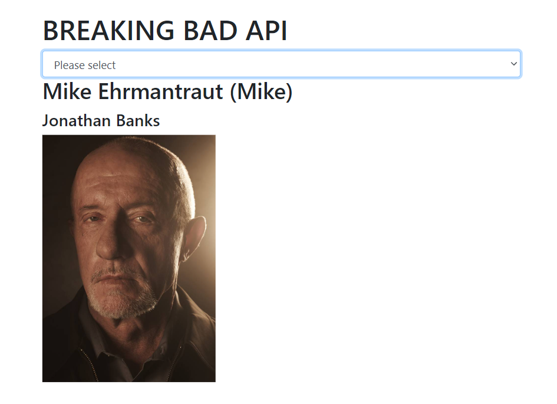

# BREAKING BAD API

> This is my first attempt of using API

# Table of contents

- 
- [Table of contents](#table-of-contents)
- [Overview](#overview)
  - [Built with](#built-with)
  - [Live demo( IF AVAILABLE 😊 )](#live-demo-if-available--)
  - [Getting Started](#getting-started)
    - [Prerequisites](#prerequisites)
    - [Setup](#setup)
  - [Author:](#author)
    - [👩 Taheny BELGUITH](#-taheny-belguith)
    - [🤝 Contributing](#-contributing)
    - [Show your support](#show-your-support)
    - [📝 License](#-license)

# Overview

  

## Built with

- Semantic HTML5 markup
- BootStrap
- 
## Live demo( IF AVAILABLE 😊 )

[Live Demo](https://tahenybelguith.github.io/Breaking-Bad-API/) 

## Getting Started

> To get a local copy up and running follow these simple example steps.

### Prerequisites

- Github Account
- IDE
- Git

### Setup

- git init
- git clone git@github.com:TahenyBELGUITH/Breaking-Bad-API.git
## Author:

### 👩 Taheny BELGUITH

- GitHub: [@TahenyBELGUITH](https://github.com/TahenyBELGUITH)
- Twitter: [@BelguithTaheny](https://twitter.com/BelguithTaheny)

### 🤝 Contributing

Contributions, issues, and feature requests are welcome!

> Feel free to check the issues page.

### Show your support

Give a ⭐️ if you like this project!

### 📝 License

This project is MIT licensed.
